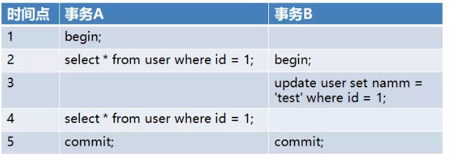
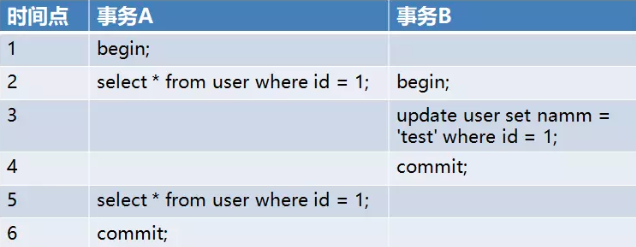

# 一致性 Consistency
```md
事务的执行结果必须是使数据库从一个一致性的状态转变到另一个状态。
指的是数据处于一种有意义的状态，这种状态是语义上的而不是语法上的。最常见的例子是转帐。

* 一致性状态
1.系统的状态满足数据的完整性约束(主码,参照完整性,check约束等) 
2.系统的状态反应数据库本应描述的现实世界的真实状态,比如转账前后两个账户的金额总和应该保持不变。
```
```md
数据库外部的一致性，由外部应用的编码来保证。
如
即某个应用在执行转帐的数据库操作时，
必须在同一个事务内部调用对帐户 A和帐户 B的操作。
```
```md
数据库内部的一致性
由数据库来保证，即在同一个事务内部的一组操作必须全部执行成功，这就是事务处理的原子性。
```
```md
并发情况下的一致性
引入了隔离性，即保证每一个事务能够看到的数据总是一致的，就好象其它并发事务并不存在一样。
```
## 对数据一致性的破坏
```md
1. 事务的并发执行
2. 事务故障或系统故障
```
* 并发控制技术和日志恢复技术
```md
1. 并发控制技术保证了事务的隔离性，使数据库的一致性状态不会因为并发执行的操作被破坏。
2. 日志恢复技术保证了事务的原子性，使一致性状态不会因事务或系统故障被破坏。
    同时使已提交的对数据库的修改不会因系统崩溃而丢失,保证了事务的持久性。
```
## 并发异常
* 脏写 - 事务回滚了其他事务对数据项的已提交修改
* 丢失更新 - 事务覆盖了其他事务对数据的已提交修改,导致这些修改好像丢失了一样。

* 脏读（Dirty Read）
```md
一个事务读取到另一个事务未提交的更新数据。
在一个进程的事务当中，更改了其中的一行数据，修改完之后就释放了锁。
另一个进程读取了该数据，此时先前的事务是还未提交，回滚了数据。
```

```md
事务 B 在时间点 3 进行了修改，导致了事务 A 在 4 中的查询出的结果其实是事务 B 修改后的。
```
* 不可重复读（Fuzzy Read）
```md
在同一个事务中，多次读取同一数据返回的结果不同，不可重复读和脏读不同的是这里读取的是已经提交过后的数据。

脏读和不可重复读的区别在于:前者读取的是事务未提交的脏数据,后者读取的是事务已经提交的数据,
只不过因为数据被其他事务修改过导致前后两次读取的结果不一样
```

```md
在事务 B 中提交的操作在事务 A 第二次查询之前，但是依然读到了事务 B 的更新结果。
```
* 幻读（Phantom）
```md
事务读取某个范围的数据时，因为其他事务的操作导致前后两次读取的结果不一致。

幻读和不可重复读的区别在于，不可重复读是针对确定的某一行数据而言，而幻读是针对不确定的多行数据。
因而幻读通常出现在带有查询条件的范围查询中
```

```md
在事务 A 中查询了两次 id 大于 1 的
在第一次 id 大于 1 查询结果中没有数据
但是由于事务 B 插入了一条 id = 2 的数据
导致事务 A 第二次查询时能查到事务 B 中插入的数据
```