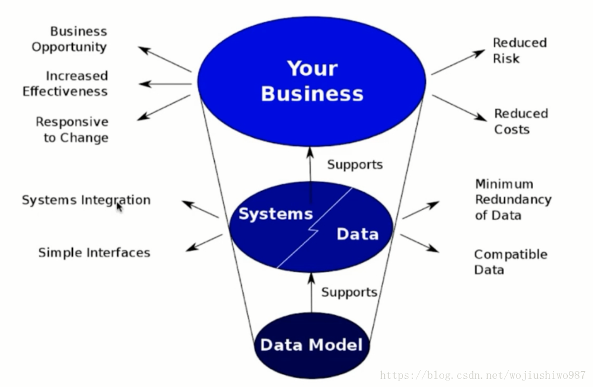

#  数据建模

## 什么是数据模型？
```md
数据模型是抽象描述现实世界的一种工具和方法，是通过抽象的实体及实体之间联系的形式，
用图形化的形式去描述业务规则的过程，从而表示现实世界中事物的相互关系的一种映射。 
```
* 实体
```md
现实世界中存在的可以相互区分的事物或概念称为实体。 实体可以分为事物实体和概念实体。
例如：一个学生、一个程序员等是事物实体。一门课、一个班级等称为概念实体。
```
* 实体的属性

## [数据建模的过程](Modeling.md)

## 数据建模的意义？

* 数据模型支撑了系统和数据，系统和数据支撑了业务系统。 
* 一个好的数据模型
```md
能让系统更好的集成、能简化接口。
能简化数据冗余、减少磁盘空间、提升传输效率。
兼容更多的数据，不会因为数据类型的新增而导致实现逻辑更改。
能帮助更多的业务机会，提高业务效率。
能减少业务风险、降低业务成本。
```
```md
举例: 借助 logstash 实现 mysql 到 Elasticsearch 的增量同步，如果数据建模阶段没有设计：时间戳或者自增ID，就几乎无法实现。
```
