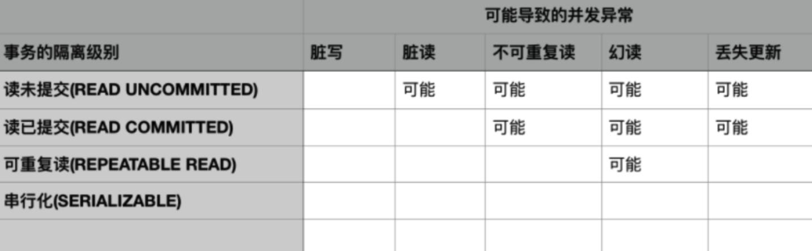

# 事务隔离性
```md
理论上来说事务之间的执行不应该相互产生影响，其对数据库的影响应该和它们串行执行时一样。
然而完全的隔离性会导致系统并发性能很低，降低对资源的利用率，
因而实际上对隔离性的要求会有所放宽，这也会一定程度造成对数据库一致性要求降低。
```
## 读隔离
```md
描述并发事务的各种干扰级别，使得应用程序可以在吞吐量和正确性上做决策，不同事务隔离级别保证不同程度的正确性。
```
* 限制：
```md
（1）未提及写操作的隔离性
（2）比较老，对于采用多版本并发控制实现事务隔离级别的标准不能够很好的描述
```
* 解决的问题：
```md
解决三种现象：
脏读（Dirty Read）
不可重复读（Fuzzy Read）
幻读（Phantom）
```
* 解决的问题：
## 写隔离
```md
脏写
写丢失（丢失更新）
```
### 隔离级别 （ANSI SQL 标准）

```md
事务的隔离级别越低，可能出现的并发异常越多，但是通常而言系统能提供的并发能力越强。

不同的隔离级别与可能的并发异常的对应关系只是理论上的，对于特定的数据库实现不一定准确。
MySQL 的 Innodb 存储引擎通过 Next-Key Locking 技术在可重复读级别就消除了幻读的可能。

所有事务隔离级别都不允许出现脏写，
而串行化隔离级别可以避免所有可能出现的并发异常，但是会极大的降低系统的并发处理能力。

四种隔离性的锁机制应用是数据库自动完成的，不需要人为干预。
隔离级别的设置只对当前链接有效。
```

* Read Uncommitted
```md
事务开始的时候，可以给要准备写操作的这一行数据加一个排它锁。如果是读操作，就给该行数据一个读锁。
这样之后，在修改该行数据的时候，不让其他进程对该行数据有任何操作。
而读该行数据的时候，其他进程不能更改，但可以读，读或写完成时，释放锁，最后commit提交，
这时候读写就分离开了，写和写也就分离开了。
此时加锁和释放锁的过程由mysql数据库自身来维护，不需要我们人为干涉。

MySQL开发者给这个解决冲突的方案起了一个名字叫做，读未提交：(Read Uncommitted)，这也就是事务的第一个隔离性。
```
* Read Committed 读已提交
```md
大多数数据库默认的隔离级别，可以解决脏读问题。
锁的位置不同，之前是只要操作完该数据就立马释放掉锁，现在是把释放锁的位置调整到事务提交之后。
此时在事务提交前，其他进程是无法对该行数据进行读取的，包括任何操作。
那么数据库为此种状态的数据库操作规则又给了一个名字叫做：读已提交（Read Committed）或者也可以叫不可重复读。
```
* Repeatable Read 可重复读
```md
MySQL数据库所默认的级别，可以解决脏读和不可重复读。
MVCC 并发版本控制来解决这个问题不可重复读问题，如果事务中存在多次读取同样的数据，
MySQL第一次读的时候仍然会保持选择读最新提交事务的数据，当第一次之后，之后再读时，Mysql会取第一次读取的数据作为结果。
MySQL把这种解决方案叫做：可重复读（Repeatable-Read)
```
* Serialibility 序列化
```md
会自动在锁住你要操作的整个表的数据，如果另一个进程事务想要操作表里的任何数据就需要等待获得锁的进程操作完成释放锁。
可避免脏读、不可重复读、幻读的发生，当然性能会下降很多，会导致很多的进程相互排队竞争锁。
```
## 事务隔离性的实现 - 并发控制技术
```md
并发控制技术是实现事务隔离性以及不同隔离级别的关键，实现方式有很多。
按照其对可能冲突的操作采取的不同策略可以分为乐观并发控制和悲观并发控制两大类。
```
* 悲观锁
```md
当前事务将所有涉及操作的对象加锁，操作完成后释放给其它对象使用，为了尽可能提高性能，发明了各种粒度（数据库级/表级/行级……），
各种性质（共享锁/排他锁/共享意向锁/排他意向锁/共享排他意向锁……）的锁
为了解决死锁问题，又发明了两阶段锁协议/死锁检测等一系列的技术。
```
* 乐观锁
```md
即不同的事务可以同时看到同一对象（一般是数据行）的不同历史版本。
如果有两个事务同时修改了同一数据行，那么在较晚的事务提交时进行冲突检测。
		
一种是通过日志UNDO的方式来获取数据行的历史版本
一种是简单地在内存中保存同一数据行的多个历史版本，通过时间戳来区分
```
### 基于封锁的并发控制
* 核心思想:对于并发可能冲突的操作，比如读-写，写-读，写-写，通过锁使它们互斥执行。
* 共享锁(S)
```md
事务T 对数据A加共享锁，其他事务只能对A加共享锁但不能加排他锁。
```
* 排他锁(X)
```md
事务 T 对数据 A加排他锁，其他事务对A既不能加共享锁也不能加排他锁。
```
* 基于锁的并发控制流程:
```md
事务根据自己对数据项进行的操作类型申请相应的锁(读申请共享锁，写申请排他锁)
申请锁的请求被发送给锁管理器，锁管理器根据当前数据项是否已经有锁以及申请的和持有的锁是否冲突决定是否为该请求授予锁。
若锁被授予，则申请锁的事务可以继续执行;
若被拒绝，则申请锁的事务将进行等待，直到锁被其他事务释放。
```
* 可能出现的问题:
```md
死锁:多个事务持有锁并互相循环等待其他事务的锁导致所有事务都无法继续执行。
饥饿:数据项A一直被加共享锁，导致事务一直无法获取A的排他锁。
```
* 总结
```md
对于可能发生冲突的并发操作，锁使它们由并行变为串行执行，是一种悲观的并发控制。
```
### 基于时间戳的并发控制
* 核心思想:对于并发可能冲突的操作，基于时间戳排序规则选定某事务继续执行，其他事务回滚。
* 流程
```md
系统会在每个事务开始时赋予其一个时间戳，这个时间戳可以是系统时钟也可以是一个不断累加的计数器值，
当事务回滚时会为其赋予一个新的时间戳，先开始的事务时间戳小于后开始事务的时间戳。

每一个数据项Q有两个时间戳相关的字段:
W-timestamp(Q):成功执行write(Q)的所有事务的最大时间戳
R-timestamp(Q):成功执行read(Q)的所有事务的最大时间戳
```
* * 时间戳排序规则如下:
```md
假设事务 T发出 read(Q)，T 的时间戳为TS
a.若TS(T)<W-timestamp(Q),则 T需要读入的 Q已被覆盖。此read操作将被拒绝，T回滚。
b.若TS(T)>=W-timestamp(Q),则执行read操作，同时把 R-timestamp(Q)设置为TS(T)与R-timestamp(Q)中的最大值。

假设事务 T发出w rite(Q)
a.若TS(T)<R-timestamp(Q),write操作被拒绝,T回滚。
b.若TS(T)<W-timestamp(Q),则write操作被拒绝,T回滚。
c.其他情况:系统执行write操作,将W-timestamp(Q)设置为TS(T)。
```
* 基于时间戳排序和基于锁实现
```md
本质一样:对于可能冲突的并发操作，以串行的方式取代并发执行，因而它也是一种悲观并发控制。

区别：
基于锁是让冲突的事务进行等待，而基于时间戳排序是让冲突的事务回滚。
基于锁冲突事务的执行次序是根据它们申请锁的顺序，先申请的先执行；而基于时间戳排序是根据特定的时间戳排序规则。
```
### 基于有效性检查的并发控制
* 核心思想
```md
事务对数据的更新首先在自己的工作空间进行，等到要写回数据库时才进行有效性检查，对不符合要求的事务进行回滚。
```
* 流程 - 三个阶段:
```md
1. 读阶段: 数据项被读入并保存在事务的局部变量中。所有write操作都是对局部变量进行，并不对数据库进行真正的更新。
2. 有效性检查阶段:对事务进行有效性检查，判断是否可以执行write操作而不违反可串行性。如果失败，则回滚该事务。
3. 写阶段:事务已通过有效性检查，则将临时变量中的结果更新到数据库中。
```
* 总结
```md
有效性检查通常也是通过对事务的时间戳进行比较完成的，不过和基于时间戳排序的规则不一样。
该方法允许可能冲突的操作并发执行，因为每个事务操作的都是自己工作空间的局部变量，
直到有效性检查阶段发现了冲突才回滚。因而这是一种乐观的并发策略。
```
### 基于快照隔离的并发控制
```md
快照隔离是多版本并发控制(MVCC)的一种实现方式。
```
* 核心思想
```md
数据库为每个数据项维护多个版本(快照)，每个事务只对属于自己的私有快照进行更新，
在事务真正提交前进行有效性检查，使得事务正常提交更新或者失败回滚。
```
* 避免出现丢失更新问题
```md
由于快照隔离导致事务看不到其他事务对数据项的更新，为了避免出现丢失更新问题,可以采用以下两种方案避免：
先提交者获胜:对于执行该检查的事务T，判断是否有其他事务已经将更新写入数据库,是则 T回滚否则 T正常提交。
先更新者获胜:通过锁机制保证第一个获得锁的事务提交其更新，之后试图更新的事务中止。
```
* 总结
```md
事务间可能冲突的操作通过数据项的不同版本的快照相互隔离，到真正要写入数据库时才进行冲突检测。
因而这也是一种乐观并发控制。
```

### [MVCC](MVCC.md)

## Q&A
* Read Committed 隔离性是在事务提交后才释放锁，为什么在写的时候另一个事务还可以读取？
```md
归因于 MySQL的 MVCC，为了提高系统的并发量，在事务未提交前，虽然事务内操作的数据是锁定状态，
但是另一个事务仍然可以读取。
```