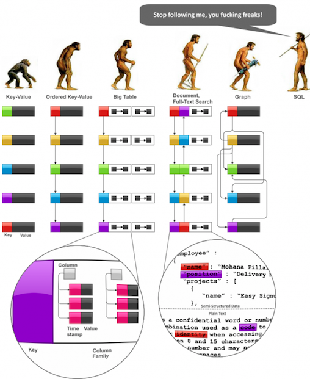

# DB Model

## Evolution

```md
发展
		Key-Value时代
			Key-Value有一个非常致命的问题，那就是如果我们需要查找一段范围内的key
			Oracle Coherence, Redis, Kyoto Cabinet
		Ordered Key-Value 有序键值模型
			没有对Value提供某种数据模型。
				通常来说，Value的模型可以由应用负责解析和存取
			这种很不方便，于是出现了 BigTable类型的数据库
		BigTable时代
			其实就是map里有map，map里再套map，一层一层套下去，
				也就是层层嵌套的key-value（value里又是一个key-value）
				这种数据库的Value主要通过“列族”（column families），列，和时间戳来控制版本。
			Apache HBase, Apache Cassandra
		Document时代
			改进了 BigTable 模型，并提供了两个有意义的改善。
				第一个是允许Value中有主观的模式（scheme）而不是map套map
				第二个是索引
			MongoDB, CouchDB
		全文搜索时代
			可以被看作是文档数据库的一个变种
				他们可以提供灵活的可变的数据模式（scheme）以及自动索引。
				他们之间的不同点主要是，文档数据库用字段名做索引，而全文搜索引擎用字段值做索引。
			 Apache Lucene, Apache Solr
		Graph数据库时代
			可以被认为是这个进化过程中从 Ordered Key-Value 数据库发展过来的一个分支
				图式数据库允许构建图结构的数据模型。
				它和文档数据库有关系的原因是，它的很多实现允许value可以是一个map或是一个document。
			neo4j, FlockDB
```
```md
Future
	大多数数据仓库将以列模式存储
	大多数 OLTP 数据库将可能是内存数据库 (IMDB)，或完全驻留在内存内
```
## [Modeling](Modeling.md)

## [Models](https://db-engines.com/en/ranking)
* Relational DBMS
```md
> MySQL
Oracle
Microsoft SQL Server
PostgreSQL
DB2
Microsoft Access
SQLite
Teradata
MariaDB
> Hive
SAP Adaptive Server
FileMaker
SAP HANA
HyperSQL
Derby
```
* Document store
```md
> MongoDB
Couchbase
CouchDB
Firebase Realtime Database
```
* Search engine
```md
> Elasticsearch
Splunk
> Solr
Sphinx
Microsoft Azure Search
```
* Key-value store
```md
> Redis 
> Memcached
Hazelcast
Riak KV
> Ehcache
Aerospike
```
* Wide column store
```md
Cassandra
> HBase
Accumulo
```
* Graph DBMS
```md
Neo4j
Giraph
JanusGraph
```
* Time Series DBMS
```md
InfluxDB
Graphite
RRDtool
```
* RDF store
```md
Jena
Algebraix
```
* Multivalue DBMS
```md
Adabas
UniData,UniVerse
jBASE
```
* Object oriented DBMS
```md
Versant Object Database
Db4o
```
* Native XML DBMS
```md
BaseX
```
* Content store
```md
Jackrabbit
```
* Event Stores
* Navigational DBMS

### Multi-model 
```md
Amazon DynamoDB
Microsoft Azure Cosmos DB
MarkLogic
```