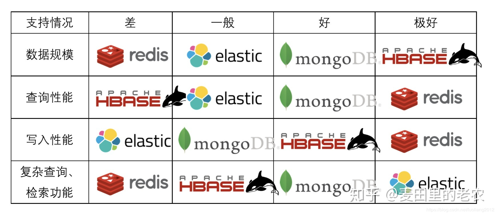

# Compare



## 适用场景
* Redis
```md
对数据的读写要求极高，并且数据规模不大，也不需要长期存储。
```
* MongoDB
```md
数据规模较大，对数据的读性能要求很高，数据表的结构需要经常变，有时还需要做一些聚合查询。
```
* ElasticSearch
```md
需要构造一个搜索引擎或者搞一个看着高大上的数据可视化平台，并且数据有一定的分析价值或者老板是土豪。
```
* HBase
```md
需要存储海量数据，不知道数据规模将来会增长多么大。
```