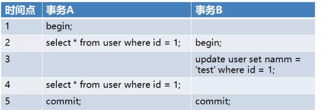
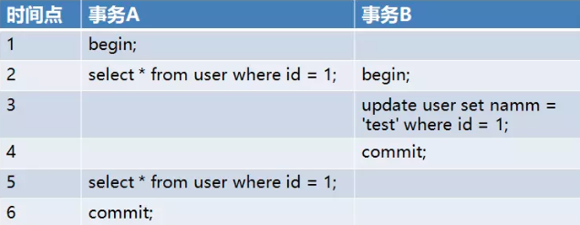
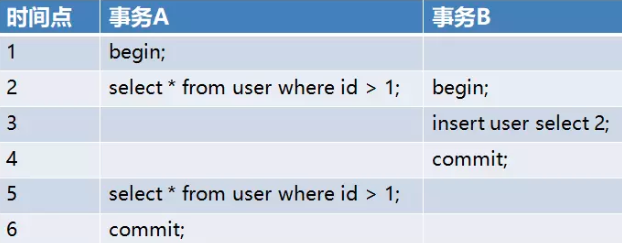
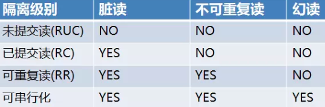

# 事务隔离性
```md
就是多个事务并发执行后的状态，和它们串行执行后的状态是等价的。
```
## 读隔离
```md
描述并发事务的各种干扰级别，使得应用程序可以在吞吐量和正确性上做决策，不同事务隔离级别保证不同程度的正确性。
```md
限制：
		（1）未提及写操作的隔离性
		（2）比较老，对于采用多版本并发控制实现事务隔离级别的标准不能够很好的描述
```
```md
解决三种现象：
		脏读（Dirty Read）
		不可重复读（Fuzzy Read）
		幻读（Phantom）
```
* 脏读（Dirty Read）
```md
	一个事务读取到另一个事务未提交的更新数据
	
		在一个进程的事务当中
			更改了其中的一行数据
				修改完之后就释放了锁
		另一个进程读取了该数据
			此时先前的事务是还未提交
				回滚了数据
```

```md
事务 B 在时间点 3 进行了修改，导致了事务 A 在 4 中的查询出的结果其实是事务 B 修改后的。
```
* 不可重复读（Fuzzy Read）
```md
在同一个事务中，多次读取同一数据返回的结果不同，不可重复读和脏读不同的是这里读取的是已经提交过后的数据
```

```md
在事务 B 中提交的操作在事务 A 第二次查询之前，但是依然读到了事务 B 的更新结果。
```
```md
* Read Committed 隔离性是在事务提交后才释放锁，为什么在写的时候另一个事务还可以读取？

归因于MySQL的MVCC，为了提高系统的并发量，在事务未提交前，虽然事务内操作的数据是锁定状态，
但是另一个事务仍然可以读取。
```
* 幻读（Phantom）
```md
一个事务读到另一个事务已提交的 insert 数据
```

```md
在事务 A 中查询了两次 id 大于 1 的
在第一次 id 大于 1 查询结果中没有数据
但是由于事务 B 插入了一条 id = 2 的数据
导致事务 A 第二次查询时能查到事务 B 中插入的数据
```

***不可重复读 和 幻读 都是读取了另一条已经提交的事务，同事务中两次读取数据不一致。***

### 隔离级别 （ANSI SQL 标准）
* Read Uncommitted
```md
	事务开始的时候
		可以给要准备写操作的这一行数据加一个排它锁
			如果是读操作，就给该行数据一个读锁
		这样之后，在修改该行数据的时候，不让其他进程对该行数据有任何操作
		而读该行数据的时候，其他进程不能更改，但可以读
		读或写完成时，释放锁，最后commit提交
			这时候读写就分离开了，写和写也就分离开了
	
		此时加锁和释放锁的过程由mysql数据库自身来维护
			不需要我们人为干涉
		MySQL开发者给这个解决冲突的方案起了一个名字叫做
			读未提交：(Read Uncommitted)
				这也就是事务的第一个隔离性
```
* Read Committed 读已提交
```md
		大多数数据库默认的隔离级别
	可以解决脏读问题
		锁的位置不同
			之前是只要操作完该数据就立马释放掉锁
			现在是把释放锁的位置调整到事务提交之后
				此时在事务提交前，其他进程是无法对该行数据进行读取的，包括任何操作
		那么数据库为此种状态的数据库操作规则又给了一个名字叫做：读已提交（Read Committed）
			或者也可以叫不可重复读
```
* Repeatable Read 可重复读
```md
		MySQL数据库所默认的级别
	可以解决脏读和不可重复读
		MVCC并发版本控制来解决这个问题不可重复读问题
		如果事务中存在多次读取同样的数据
			MySQL第一次读的时候仍然会保持选择读最新提交事务的数据
			当第一次之后，之后再读时，mysql会取第一次读取的数据作为结果
		MySQL把这种解决方案叫做：可重复读（Repeatable-Read)
```
* Serialibility 序列化
```md
  会自动在锁住你要操作的整个表的数据
			如果另一个进程事务想要操作表里的任何数据就需要等待获得锁的进程操作完成释放锁
		可避免脏读、不可重复读、幻读的发生
			当然性能会下降很多，会导致很多的进程相互排队竞争锁
```

```md
四种隔离性的锁机制应用是数据库自动完成的，不需要人为干预
隔离级别的设置只对当前链接有效
```
## 写隔离
```md
	脏写
	写丢失
```
## 实现
```md
	悲观锁
		当前事务将所有涉及操作的对象加锁，操作完成后释放给其它对象使用
		为了尽可能提高性能，发明了各种粒度（数据库级/表级/行级……）
			各种性质（共享锁/排他锁/共享意向锁/排他意向锁/共享排他意向锁……）的锁
		为了解决死锁问题，又发明了两阶段锁协议/死锁检测等一系列的技术
```
```md
	乐观锁
		即不同的事务可以同时看到同一对象（一般是数据行）的不同历史版本
		如果有两个事务同时修改了同一数据行，那么在较晚的事务提交时进行冲突检测
		
			一种是通过日志UNDO的方式来获取数据行的历史版本
			一种是简单地在内存中保存同一数据行的多个历史版本，通过时间戳来区分
```
